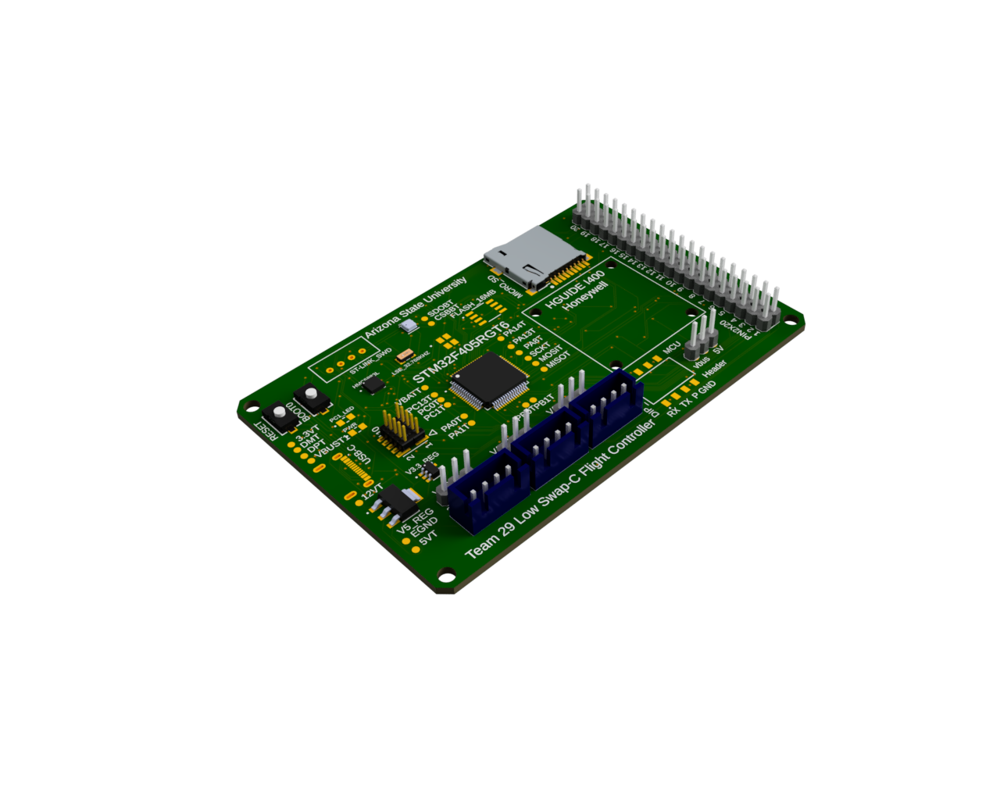

# 🚀 Low-SWaP-C Flight Controller (Capstone Project)

Welcome to our senior capstone project: a **Low Size, Weight, Power, and Cost (SWaP-C)** flight controller designed for drone and embedded aerospace systems. 

---

## 📸 Current Design

---

## 🧠 What It Does

- 📦 **Low SWaP-C**: Built to be efficient and compact without sacrificing performance
- 📈 **Sensor Fusion**: IMU + Magnetometer + Barometer integration
- 🔌 **Modular Inputs/Outputs**: UART, I2C, PWM, etc.
- 🧭 **Navigation Ready**: GPS support and sensor data streaming
- 🎛️ **Open Source Firmware**: Custom code optimized for STM32 (or replace with your MCU)

---

## 🔧 How It Works

### 🛠️ Hardware Overview
- MCU: STM32F405 (or your MCU)
- IMU: Honeywell I400 MEMS
- Power: 3.3V and 5V regulation onboard

### 🧬 Software Features
- Written in C/C++ (compatible with Circuit python / STM32CubeIDE)
- Real-time sensor polling and filtering
- ESC signal generation and control logic
- Easy-to-read modular firmware

---

## 🎯 Use Cases

- Autonomous drone control systems
- Flight controller development kits
- Prototyping lightweight UAS
- Educational use for embedded systems and control theory

